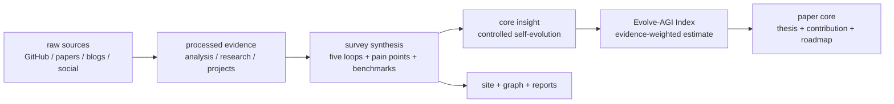
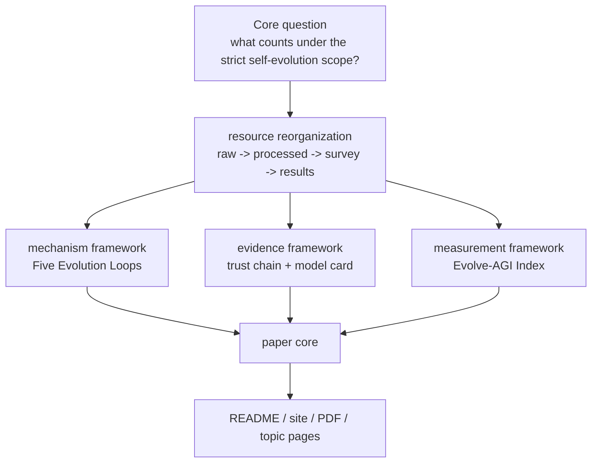

# Awesome Self-Evolving AI Agents

**A survey-first map for judging whether an AI agent really improves from feedback, or merely looks impressive in a demo.**

[Chinese](README.md) | [English](README-EN.md) | [Website](https://agent-evolution.com/) | [Paper PDF](paper-drafts/main.pdf) | [Evolve-AGI Index](analysis/evolve-agi-index.md) | [Project Index](projects/INDEX.md)

GitHub Topics: `agent-evolution`, `self-evolving-agents`, `self-evolution`, `self-improvement`, `ai-agent`, `llm-agent`, `agent-swarm`, `memory-system`, `skill-library`, `harness-engineering`, `benchmark`.

GitHub topic evidence (2026-06-05): [GitHub Topic Indexing Readiness](reports/github-topic-indexing-readiness.md) verifies that repository topics, GitHub Search, and the rendered topic page all return this repository; if the rendered topic page briefly lags, treat GitHub search/API as the fresher evidence.


## One Sentence

To judge whether an AI agent is actually self-evolving, ask five questions first: what changed, why it changed, who verified it, whether it was retained, and whether it can roll back.

## Three Sentences

1. This survey does not start with a link dump. It starts with a judgment checklist: did the system change its prompt, memory, workflow, code, weights, or only its wording?
2. The standard is simple: do not stop at names, stars, or demos; ask whether the system forms an Observe -> Interpret -> Modify -> Verify -> Retain loop.
3. The [Evolve-AGI Index](analysis/evolve-agi-index.md) is currently a provisional evidence scorecard: it helps compare benchmark, loop, transfer, and governance evidence, but it is not an AGI score and not a final project ranking.

## Five Sentences

1. This is not a standard Awesome List; it is an open survey of how AI agents can reliably improve themselves.
2. Under this survey's strict scope, a self-evolving system should identify its mutable object, feedback signal, update operator, independent evaluator, retention mechanism, and rollback path.
3. The most reviewable mechanism skeleton is the Five Evolution Loops: specification-to-execution, search, evaluator, reflection/memory, and population/archive.
4. The Evolve-AGI Index puts benchmark performance, loop strength, evidence credibility, transfer verification, implementation access, field momentum, and governance readiness into one discussable table; its weights are editorial/proposed, not a peer-reviewed field standard.
5. Use this page to reach the paper, project model cards, public reports, knowledge graph, and website without drowning in hundreds of links.

## What You Can Use It For

| Reader | What you get |
|---|---|
| Researchers | A survey spine from taxonomy, methods, systems, and evaluation to the future roadmap. |
| Builders | A way to judge whether an agent project has verifiable feedback, auditable memory, evaluator harnesses, and rollback paths. |
| Product, investment, and industry readers | A way to separate real capability accumulation from benchmark gaming, demos, and governance gaps. |
| Writers and educators | An evidence-backed topic map across projects, papers, trends, pain points, graphs, and long-tail topic pages. |

## Start Here

| Who you are | Read first | What you take away |
|---|---|---|
| New reader | [Definition topic page](https://agent-evolution.com/en/topics/self-evolving-ai-agents/) | A checklist: what changed, who verified it, how it is retained, and whether it can roll back. |
| Research reader | [Five evolution loops](https://agent-evolution.com/en/topics/five-evolution-loops/) | A mechanism map that separates specification, search, evaluation, reflection, and population archives. |
| Builder | [Code self-improvement Benchmark Matrix](https://agent-evolution.com/en/topics/code-evolution-benchmark/) and [review-gated project reports](projects/INDEX.md) | A way to compare evaluator strength, archive evidence, lineage, and limitations instead of demos. |
| Trend or product reader | [2026 star-growth fetch pilot](https://agent-evolution.com/star-growth/) and [Value LSH evidence triage](https://agent-evolution.com/value-lsh/) | A separation between historical popularity, current momentum, heuristic triage, and evidence repair. |

English readers can now follow the core path through `/en/`: definition, five loops, code benchmark matrix, projects, report status, Value LSH, resource coverage, survey snapshot, research map, evidence graph, star-growth pilot, Evolve-AGI worksheet, paper status, and blog guide. Long-tail article bodies and many report pages remain Chinese-first or source-tracing pages, so this repository still does not claim complete translation parity.

## Evidence Pipeline



## Recent Evidence Updates (2026-06-05)

This update is not just a metadata refresh. It pulls a production swarm, a coding-agent harness, a safety-sensitive memory benchmark, an OpenAI Agents SDK orchestrator, continual skill-memory paper code, and a lightweight memory/MCP/skill runtime back onto one evidence chain.

| Repository | Evidence gap filled | Why it matters | Evidence state |
|---|---|---|---|
| [desplega-ai/agent-swarm](https://github.com/desplega-ai/agent-swarm) | Production lead-worker swarm runtime | It turns agent-swarm from a "many roles" idea into a Docker-worker execution plane with persistent identity, compounding memory, and HITL workflow gates. | [KNOWN] GitHub source-scoped; no independent production audit here. |
| [ComposioHQ/agent-orchestrator](https://github.com/ComposioHQ/agent-orchestrator) | Coding-agent swarm harness with worktree isolation | It shows how coding-agent orchestration becomes an engineering control plane with parallel worktrees, reusable skills, memory, and review gates instead of a single-thread agent demo. | [KNOWN] GitHub source-scoped; engineering-control wording needs runs/tests/log reviews. |
| [VRSEN/agency-swarm](https://github.com/VRSEN/agency-swarm) | OpenAI Agents SDK orchestration baseline | It shows how a 2026 production multi-agent orchestrator has already moved from Assistants-era framing to Agents SDK-era communication, tools, and persistence. | [KNOWN] public-repo/source-scoped; SDK migration wording needs upstream rechecks. |
| [XSkill-Agent/XSkill](https://github.com/XSkill-Agent/XSkill) | Continual skill-memory benchmarked paper code | It fills the layer where skills and experiences are accumulated, stored, retrieved, and reused on benchmarks instead of being described only as a continual-learning idea. | [KNOWN] paper-code/source-scoped; benchmark claims are not reproduced by this site. |
| [AQ-MedAI/MedMemoryBench](https://github.com/AQ-MedAI/MedMemoryBench) | Safety-sensitive longitudinal memory benchmark | It moves memory evaluation from generic recall toward personalized healthcare settings where remembering the right longitudinal context matters more than simply remembering more. | [KNOWN] benchmark-repo/source-scoped; medical setting claims need safety/evaluation review. |
| [wanxingai/LightAgent](https://github.com/wanxingai/LightAgent) | Lightweight memory/MCP/skill runtime refresh | It refreshes the lightweight runtime line with current public evidence for LightFlow, native skills, persistent memory, and trace observability. | [KNOWN] repo snapshot/source-scoped; runtime claims still need tests/logs review. |

## Core Insight

One sentence: the core insight is to turn Self-Evolving AI Agents from a story about self-improvement into an auditable improvement system.

Three sentences: A system enters this survey's self-evolution scope only when feedback changes its prompt, memory, tool policy, workflow, code, weights, or population and leaves verifiable evidence. All resources behind the survey are now reorganized around one question: what object changes, what signal drives it, and what prevents the change from becoming harmful. The Evolve-AGI Index is a working evidence worksheet for that reorganization, exposing whether benchmark, loop, transfer, and governance evidence is strong enough rather than assigning a final field score.

Five-sentence expansion:

1. Readers used to move between links, stars, paper lists, and site pages on their own; now they see the conclusion first, then the evidence path.
2. The survey is not just a literature roundup; it cross-checks papers, projects, benchmarks, social/blog signals, and user pain points.
3. The key judgment is no longer whether a project name includes "evolution"; it is whether the system forms an Observe -> Interpret -> Modify -> Verify -> Retain loop.
4. The Evolve-AGI Index is no longer just a site module; it becomes a method prototype for placing different evidence types into one inspectable table while exposing weights, denominators, and validation gaps.
5. Every core claim exposed to readers should trace back to the paper, project reports, data indexes, or benchmark evidence; unsupported claims are marked `[UNVERIFIED]`.

## Core Findings

| Rank | Survey finding | Meaning for readers | Evidence entry |
|---:|---|---|---|
| 1 | Self-evolution is a controlled systems process, not a demo label. | Read every project by asking what changed, who verified it, and how it rolls back. | [paper abstract](paper-drafts/main.tex), [ch1 intro](paper-drafts/ch1-intro.tex) |
| 2 | Benchmarks are both selection pressure and risk. | Score gains are not capability accumulation unless hidden tests, transfer, cost, and rejected candidates are reported. | [ch5 evaluation](paper-drafts/ch5-evaluation.tex), [survey ch5](survey/ch5-evaluation-cn.md) |
| 3 | Memory, skills, and harnesses are core infrastructure. | Do not only inspect the model layer; auditable memory, installable skills, and evaluators determine long-term usefulness. | [ch7 painpoints](paper-drafts/ch7-painpoints.tex), [agent-swarm evolve](analysis/agent-swarm-evolve.md) |
| 4 | Five evolution loops are more stable than project names. | New systems can be classified by mechanism instead of marketing labels. | [survey methods](survey/ch3-methods-cn.md), [method taxonomy](survey/figures/method-taxonomy-mermaid.md) |
| 5 | The Evolve-AGI Index is only a working evidence worksheet. | It separates benchmark, loop, evidence, transfer, access, momentum, and governance signals; it is not a field standard. | [Evolve-AGI Index](analysis/evolve-agi-index.md), [trend snapshot](reports/evolve-agi-index-trend.json) |
| 6 | Users care most about the trust boundary. | Product value comes from reliability, transparency, control, and cost, not from autonomy rhetoric. | [survey ch7](survey/ch7-painpoints-cn.md), [site survey](site/src/pages/survey/index.astro) |
| 7 | Failed candidates and negative results are assets. | Without rejected patches, regressions, and lineage, we cannot judge whether a system truly evolves. | [ch8 future](paper-drafts/ch8-future.tex), [survey spark analysis](analysis/survey-resource-spark.md) |

## Evolve-AGI Index In The Paper Core

One sentence: the Evolve-AGI Index is a provisional evidence-maturity scorecard for this survey, not a final AGI capability score and not a final project ranking.

```text
EAI = Σ(signal_score × signal_weight)
```

| Signal | Weight | Why it belongs in the core |
|---|---:|---|
| Benchmark performance | 18% | Self-evolution must face measurements, but benchmarks cannot decide maturity alone. |
| Core loop strength | 20% | Without mutable object, feedback, selection, and retention, there is no self-evolution. |
| Evidence-chain credibility | 18% | Raw sources, analysis, model cards, and paper appendices must be traceable. |
| Transfer and verification | 14% | Gains on one public test do not prove capability accumulation. |
| Implementation access | 12% | A system must run, transfer, and be inspectable to matter as engineering. |
| Field momentum | 10% | New projects and community motion are trend signals, but cannot override evidence quality. |
| Governance readiness | 8% | Self-modifying systems need safety boundaries, logs, rollback, and timestamp confidence. |

The weights are editorial/proposed weights for this survey: they make different evidence types discussable in one table, but they are not yet a peer-reviewed field standard, and they still need sensitivity analysis and uncertainty estimates.

**Data Snapshot:** the Evolve-AGI trend uses the `2026-06-01` trend-input snapshot: `93` strict evolution repos, `200` broad evolution repos, and `239` trend public-report records. Repository governance and site coverage use the latest generated [docs/indexes/master-index.md](docs/indexes/master-index.md) scope: `684` classified GitHub repositories, `292` analyzed project/model-card reports, `99` strict evolution repos, `205` broad evolution repos, and `490` public project report files. Do not mix those denominators: the former supports trend reconstruction; the latter supports repository coverage auditing. Public project reports are indexable evidence pages, not per-page quality-certified conclusions.

## Survey Evidence Map

| Layer | Current role | Evidence |
|---|---|---|
| Source evidence | Keeps GitHub, paper, blog, and social material as the starting point for claims. | [raw index](docs/indexes/raw-index.md), `raw-github/`, `raw-papers/`, `raw-social/`, `raw-blogs/` |
| Processed analysis | Turns sources into classifications, mechanisms, model cards, paper reviews, evidence queues, and the Evolve-AGI Index. | [processed index](docs/indexes/processed-index.md), [GitHub analysis](analysis/github-project-data-analysis.md), [projects index](projects/INDEX.md) |
| Survey paper | Turns mechanisms, systems, evaluation, industry practice, pain points, and futures into paper structure. | [survey CN chapters](survey/ch1-intro-cn.md), [paper drafts](paper-drafts/main.tex), [survey latex](survey/latex/main.tex) |
| Public results | Publishes PDFs, site pages, reports, graphs, trend snapshots, and topic pages. | [results index](docs/indexes/results-index.md), [site](site/src/pages/index.astro), [reports](reports/) |
| Evidence catalog | Lets readers inspect evidence chains, indexes, and public results. | [CONTENT_INDEX.md](CONTENT_INDEX.md), [master index](docs/indexes/master-index.md) |



## Paper Spine

| Chapter | Survey result | Current entry |
|---|---|---|
| Ch1 Introduction | Defines self-evolution and adds the Evolve-AGI Index as an evidence-to-index method prototype. | [paper-drafts/ch1-intro.tex](paper-drafts/ch1-intro.tex) |
| Ch2 Taxonomy | Separates continual learning, online learning, self-supervision, AutoML, RL, and strict-scope self-evolution. | [paper-drafts/ch2-taxonomy.tex](paper-drafts/ch2-taxonomy.tex) |
| Ch3 Methods | Explains how feedback becomes retained change through the Five Evolution Loops. | [paper-drafts/ch3-methods.tex](paper-drafts/ch3-methods.tex) |
| Ch4 Systems | Compares Self-Refine, Reflexion, ADAS, DGM, AlphaEvolve, Absolute Zero, and related systems. | [paper-drafts/ch4-evolutionary.tex](paper-drafts/ch4-evolutionary.tex) |
| Ch5 Evaluation | Puts benchmarks, trajectories, transfer, cost, regression, and Goodhart risk onto one evaluation surface. | [paper-drafts/ch5-evaluation.tex](paper-drafts/ch5-evaluation.tex) |
| Ch6 Frameworks | Discusses runtime, memory, harness, workflow, tool sandbox, and reference architectures. | [paper-drafts/ch6-frameworks.tex](paper-drafts/ch6-frameworks.tex) |
| Ch7 Pain Points | Uses real user pain points to test the research agenda: reliability, cost, observability, permissions, and memory pollution. | [paper-drafts/ch7-painpoints.tex](paper-drafts/ch7-painpoints.tex) |
| Ch8 Future | Discusses how the Evolve-AGI Index could evolve from a working evidence worksheet into a stricter field knowledge data model. | [paper-drafts/ch8-future.tex](paper-drafts/ch8-future.tex) |

## How To Read This Repository

| You want to know | Read first | Then read |
|---|---|---|
| The one-line field thesis | [Core Insight](#core-insight) | [paper abstract](paper-drafts/main.tex) |
| What counts under the strict self-evolution scope | [Definition topic page](https://agent-evolution.com/en/topics/self-evolving-ai-agents/) | [definition criteria](analysis/self-evolution-definition-criteria.md), [ch1 intro](paper-drafts/ch1-intro.tex) |
| How self-evolution actually happens | [Five evolution loops](https://agent-evolution.com/en/topics/five-evolution-loops/) | [five-loop analysis](analysis/five-evolution-loops-topic.md), [survey mechanisms](site/src/pages/survey/mechanisms.astro) |
| Which systems really improve code | [Code self-improvement Benchmark Matrix](https://agent-evolution.com/en/topics/code-evolution-benchmark/) | [code benchmark matrix](analysis/code-evolution-benchmark-matrix.md), [benchmark page](site/src/pages/benchmark/index.astro) |
| Which projects count as self-evolving under this survey | [Core Findings](#core-findings) | [projects/INDEX.md](projects/INDEX.md), [analysis/github-project-data-analysis.md](analysis/github-project-data-analysis.md) |
| Which projects are growing in 2026 | [Public star-growth pilot ledger](https://agent-evolution.com/star-growth/) | [GitHub star growth analysis](analysis/github-star-growth-ranking.md), [data-engine schema](data-engine/github-star-history/README.md) |
| Which materials deserve deeper review first | [Value LSH evidence triage](https://agent-evolution.com/value-lsh/) | [value LSH index](analysis/value-lsh-index.md), [evidence repair queue](analysis/value-evidence-repair-queue.md) |
| How the paper is organized | [Paper Spine](#paper-spine) | [English paper page](https://agent-evolution.com/en/paper/), [paper-drafts/main.tex](paper-drafts/main.tex), [survey/latex/main.tex](survey/latex/main.tex) |
| Which figures support the survey and paper | [Paper figure page](https://agent-evolution.com/paper/) and [visualization page](https://agent-evolution.com/visualizations/) | [survey figures](survey/figures/README.md), [paper figure exporter](scripts/export_survey_figures_for_paper.mjs), [paper figure assets](paper-drafts/figures/) |
| What boundary the AGI index has | [Evolve-AGI Index In The Paper Core](#evolve-agi-index-in-the-paper-core) | [analysis/evolve-agi-index.md](analysis/evolve-agi-index.md), [site page](site/src/pages/evolve-agi-index/index.astro) |
| Where the full lists live | [CONTENT_INDEX.md](CONTENT_INDEX.md) | [docs/indexes/master-index.md](docs/indexes/master-index.md) |
| Where the site and topic pages live | [site](site/) | [site survey page](site/src/pages/survey/index.astro), [graph page](site/src/pages/graph/index.astro) |

## Evidence Boundary

- [KNOWN] Repository-wide governance counts come from [docs/indexes/master-index.md](docs/indexes/master-index.md), generated by `node scripts/generate_project_indexes.mjs`.
- [KNOWN] GitHub corpus counts, strict/broad evolution subsets, and time slices come from [analysis/github-project-data-analysis.md](analysis/github-project-data-analysis.md) and the paired JSON.
- [KNOWN] GitHub star-growth pilot evidence comes from [data-engine/github-star-history/](data-engine/github-star-history/), [analysis/github-star-growth-ranking.md](analysis/github-star-growth-ranking.md), and the public [star-growth page](https://agent-evolution.com/star-growth/); total stars are only an adoption prior, and definitive 2026 growth claims require `complete_or_near_complete` coverage.
- [KNOWN] Value LSH evidence comes from [analysis/value-lsh-index.md](analysis/value-lsh-index.md), [data-engine/value-lsh-index/](data-engine/value-lsh-index/), and the public [value-lsh page](https://agent-evolution.com/value-lsh/); it is a deep-review and evidence-repair triage map, not a final value judgement.
- [KNOWN] Coverage boundaries, count meanings, and current gaps come from [analysis/resource-library-coverage-audit.md](analysis/resource-library-coverage-audit.md); for the latest raw/classified/model-card/public-report counts, use [docs/indexes/master-index.md](docs/indexes/master-index.md) and [analysis/github-project-data-analysis.md](analysis/github-project-data-analysis.md).
- [KNOWN] Evolve-AGI Index methodology, weights, and benchmark inputs come from [analysis/evolve-agi-index.md](analysis/evolve-agi-index.md), [site/src/data/evolveAgiIndex.ts](site/src/data/evolveAgiIndex.ts), and [reports/evolve-agi-index-trend.json](reports/evolve-agi-index-trend.json).
- [KNOWN] Survey chapters and the paper draft come from [paper-drafts/main.tex](paper-drafts/main.tex) and [survey/latex/main.tex](survey/latex/main.tex).
- [KNOWN] GitHub topic discovery status comes from [reports/github-topic-indexing-readiness.md](reports/github-topic-indexing-readiness.md): the remote `agent-evolution` topic, repository description/homepage, GitHub Search, and rendered topic page are verified; topic-page display lag is not the same as missing metadata.
- [KNOWN] Repository-wide text asset coverage is audited by [reports/text-asset-indexability.md](reports/text-asset-indexability.md); it separates public HTML assets, GitHub README assets, processed-but-unrouted files, raw-do-not-publish sources, and external mirrors.
- [KNOWN] Google/SEO publication status must combine local sitemap/meta audits with live crawl prerequisites; [reports/live-publication-readiness.md](reports/live-publication-readiness.md) separates "generated site is indexable" from "the custom domain is reachable over strict HTTPS."
- [INFERRED] The "core insight" is a synthesis over those sources: upgrading the Awesome repository into a survey + index + evidence graph for controlled self-evolution, not a simple link site.

## Reader Next Steps

| Goal | Recommended entry |
|---|---|
| Understand the field quickly | Start with the core findings and the Evolve-AGI Index in this README. |
| Read the paper deeply | Open [paper-drafts/main.pdf](paper-drafts/main.pdf) or the [paper page](site/src/pages/paper/index.astro). |
| Inspect project evidence | Use [projects/INDEX.md](projects/INDEX.md) and [public project reports](site/public/reports/projects/INDEX.md). |
| Check data coverage | Start with the [resource library page](https://agent-evolution.com/resource-library/), then inspect [analysis/resource-library-coverage-audit.md](analysis/resource-library-coverage-audit.md), [docs/indexes/master-index.md](docs/indexes/master-index.md), and [analysis/github-project-data-analysis.md](analysis/github-project-data-analysis.md). |
| Find topics by question | Open the [English topic guide](https://agent-evolution.com/en/topics/) for definitions, five loops, [code self-improvement](https://agent-evolution.com/en/topics/code-evolution-benchmark/), Agent-Swarm, evaluation governance, and production pain points. |
| Browse the website | Open the [Self Evolve site](https://agent-evolution.com/) or the [site source](site/). |

## Citation

```bibtex
@misc{awesomeSelfEvolvingAgents2026,
  title        = {Awesome Self-Evolving AI Agents: Survey, Evidence Graph, and Evolve-AGI Index},
  author       = {aha team},
  year         = {2026},
  howpublished = {\url{https://github.com/shiyao-huang/awesome-agent-evolution}},
  note         = {Open survey repository for self-evolving AI agents, benchmark evidence, project model cards, and field maturity indexing.}
}
```
