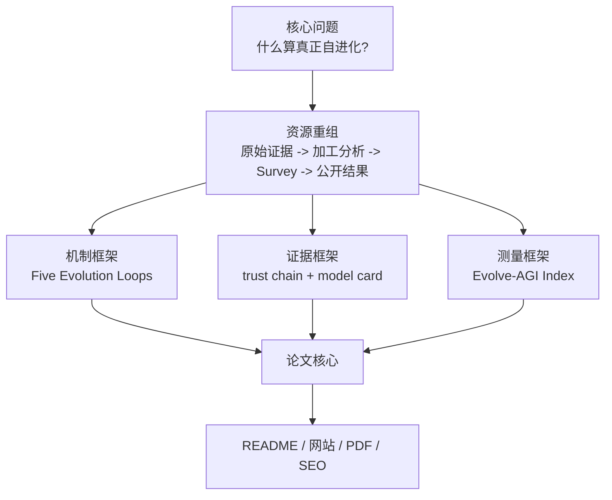

# Awesome Self-Evolving AI Agents

**一份面向 AI Agent 自进化研究与实践的开放 Survey：连接论文、项目、benchmark、公开报告与 Evolve-AGI Index。**

[中文主入口](README.md) | [英文版](README-EN.md) | [在线网站](https://shiyao-huang.github.io/awesome-agent-evolution/) | [论文 PDF](paper-drafts/main.pdf) | [Evolve-AGI Index](analysis/evolve-agi-index.md) | [项目报告](projects/INDEX.md)

GitHub Topics: `agent-evolution`, `self-evolving-agents`, `self-evolution`, `self-improvement`, `ai-agent`, `llm-agent`, `agent-swarm`, `memory-system`, `skill-library`, `harness-engineering`, `benchmark`.

GitHub topic 收录状态（2026-06-05）：GitHub API 和 `gh search repos 'topic:agent-evolution'` 已经能看到 `Shiyao-Huang/awesome-agent-evolution`；如果网页话题页仍显示旧仓库或短暂缺席，优先按 GitHub search/API 证据判断，这是 GitHub topic 页面缓存或同步延迟，不代表本仓库没有设置 `agent-evolution` topic。


## 一句话

想判断一个 AI Agent 是真的在自我改进，还是只是在演示里显得聪明？这份 Survey 给你一套可追溯的答案：看它改了什么、用什么反馈、谁来验证、能否迁移、如何回滚。

## 三句话

1. 我们把论文、开源项目、benchmark、博客/社交信号和真实用户痛点放进同一条证据链，让读者先看判断，再查证据。
2. 判断标准很简单：不要只看名字、stars 或 demo，要看它是否形成 Observe -> Interpret -> Modify -> Verify -> Retain 的闭环。
3. [Evolve-AGI Index](analysis/evolve-agi-index.md) 已进入论文核心：它不是 AGI 能力分，而是衡量自进化智能体领域成熟度的证据指数。

## 五句话

1. 这不是普通 Awesome List，而是一份围绕“AI Agent 如何可靠地改进自己”的开放 Survey。
2. 真正的自进化系统必须说明可变对象、反馈信号、更新算子、独立评估器、保留机制和回滚路径。
3. 当前最清晰的机制骨架是五类进化回路：反思/记忆、符号组件、验证驱动代码、架构搜索、课程/权重/种群演化。
4. Evolve-AGI Index 把 benchmark 表现、闭环强度、证据可信度、迁移验证、可运行性、领域动量和治理成熟度放进同一个可审计指标，避免把热度误读成能力成熟。
5. 读者可以从这里快速进入论文、项目 model card、公开报告、知识图谱和网站，而不是被几百个链接淹没。

## 你可以直接用它做什么

| 读者 | 你会得到什么 |
|---|---|
| 研究者 | 一套从分类、方法、系统、评估到未来路线图的 Survey 主线。 |
| 工程师 | 判断一个 agent 项目是否具备可验证反馈、可审计记忆、评估框架和回滚能力。 |
| 产品/投资/行业读者 | 区分真实能力积累、刷榜、演示热度和治理成熟度。 |
| 内容创作者 | 获得带证据入口的选题地图：项目、论文、趋势、痛点、图谱和长尾 SEO 页面。 |

## 本轮 GitHub Metadata 修复包（2026-06-05）

| 仓库 | 这轮补了什么 | 为什么重要 |
|---|---|---|
| [desplega-ai/agent-swarm](https://github.com/desplega-ai/agent-swarm) | 新增 raw capture、project card、site public report 与分类元数据，统一到 2026-06-05 的公开 GitHub 页面与 release/README dated signal 证据。 | 它把 agent-swarm 从“多角色编排”推进到带 Docker worker、persistent identity、compounding memory 和 HITL workflow gate 的生产执行面。 |
| [VRSEN/agency-swarm](https://github.com/VRSEN/agency-swarm) | 把旧的静态项目说明升级成 current public model card，并补入 site public report 与项目注册表。 | 它回答的是 production multi-agent 编排在 2026 年已经如何从 Assistants API 迁移到 Agents SDK，并保留通信流、工具和状态持久化。 |
| [XSkill-Agent/XSkill](https://github.com/XSkill-Agent/XSkill) | 新增 raw capture、paper-code model card 与 site public report，并把 continual-learning 证据接回 benchmark/eval 面。 | 它补的是“skills 和 experiences 如何被积累、存储、检索并在 benchmark 上复用”这一层，而不是只给一个 continual-learning 口号。 |
| [wanxingai/LightAgent](https://github.com/wanxingai/LightAgent) | 刷新 raw capture、project card、site public report 与分类元数据，统一到 2026-06-02 的 release/README dated signal。 | 它把轻量 agent runtime 这条线补到 LightFlow、native skills、persistent memory 和 trace observability 的最新公开证据。 |

## 核心洞察

一句话：本项目的核心洞察，是把 Self-Evolving AI Agents 从“自我改进的故事”变成“可审计的改进系统”。

三句话：一个系统只有在反馈中改变自己的 prompt、memory、tool policy、workflow、code、weights 或 population，并且保留可验证证据时，才进入自进化范围。Survey 背后的全部资源现在按同一个问题重排：哪个对象在变，什么信号驱动它变，谁阻止它变坏。Evolve-AGI Index 是这次重排后的测量主线，它把论文发现、GitHub 语料、benchmark 和治理要求接成一条可复跑的数据流。

五句话展开：

1. 过去读者需要在链接、star 排名、论文列表和网站材料之间自行判断；现在先看到结论，再进入证据。
2. Survey 不是“论文综述合集”，而是把论文、项目、benchmark、社交/博客信号和用户痛点互相校验。
3. 关键判断不再是“项目名字里有没有 evolution”，而是“系统是否形成 Observe -> Interpret -> Modify -> Verify -> Retain 的闭环”。
4. Evolve-AGI Index 不只是网站模块，而是论文的核心贡献之一：给这个领域一个可解释的成熟度坐标系。
5. 对外读者看到的每个核心判断都应该能回到论文、项目报告、数据索引或 benchmark 证据；没有证据链的结论标记为 `[UNVERIFIED]`。

## 核心结论

| 排名 | Survey 结论 | 对读者的意义 | 证据入口 |
|---:|---|---|---|
| 1 | 自进化是受控系统过程，不是 demo 标签。 | 读任何项目先问“改了什么、谁验证、怎么回滚”。 | [paper abstract](paper-drafts/main.tex), [ch1 intro](paper-drafts/ch1-intro.tex) |
| 2 | Benchmark 是选择压力，也是风险源。 | 分数提高不等于能力积累；要看隐藏测试、迁移、成本、失败候选。 | [ch5 evaluation](paper-drafts/ch5-evaluation.tex), [survey ch5](survey/ch5-evaluation-cn.md) |
| 3 | 记忆、技能、评估框架是核心基础设施。 | 不要只看模型层；可审计记忆、可安装技能和评估器才决定长期可用性。 | [ch7 painpoints](paper-drafts/ch7-painpoints.tex), [agent-swarm evolve](analysis/agent-swarm-evolve.md) |
| 4 | 五类进化回路比项目名更稳定。 | 新项目可以按机制归类，而不是被营销词牵着走。 | [survey methods](survey/ch3-methods-cn.md), [method taxonomy](survey/figures/method-taxonomy-mermaid.md) |
| 5 | Evolve-AGI Index 应成为论文核心指标。 | 它把成熟度拆成 benchmark、闭环、证据、迁移、可运行、动量、治理七个信号。 | [Evolve-AGI Index](analysis/evolve-agi-index.md), [trend snapshot](reports/evolve-agi-index-trend.json) |
| 6 | 用户真正关心信任边界。 | 产品价值来自可靠、透明、可控、低成本，不来自“更自主”的口号。 | [survey ch7](survey/ch7-painpoints-cn.md), [site survey](site/src/pages/survey/index.astro) |
| 7 | 失败候选和负结果是资产。 | 没有被拒补丁、回归记录和 lineage，无法判断系统是否真的会进化。 | [ch8 future](paper-drafts/ch8-future.tex), [survey spark analysis](analysis/survey-resource-spark.md) |

## Evolve-AGI Index 进入论文核心

一句话：Evolve-AGI Index 是本 survey 的“领域成熟度仪表盘”，不是 AGI 终局能力评分。

```text
EAI = Σ(signal_score × signal_weight)
```

| 信号 | 权重 | 为什么进入核心 |
|---|---:|---|
| Benchmark 表现 | 18% | 自进化必须接受实测；但 benchmark 不能单独决定成熟度。 |
| 闭环强度 | 20% | 没有可变对象、反馈、选择和保留机制，就没有自进化。 |
| 证据链可信度 | 18% | 原始材料、分析、model card 和论文附录必须互相能追溯。 |
| 迁移与验证 | 14% | 只在一个公开测试上涨分，不能证明能力积累。 |
| 实现可获得性 | 12% | 能运行、能复用、能审计，才有工程价值。 |
| 领域动量 | 10% | 新项目和社区动量是趋势信号，但不能覆盖证据质量。 |
| 治理准备度 | 8% | 自修改系统必须有安全边界、日志、回滚和时间戳信心。 |

当前快照来自 [reports/evolve-agi-index-trend.json](reports/evolve-agi-index-trend.json)：2026-06-01 的指数为 `72.9`，benchmark 子指数为 `80.1`，对应 `93` 个 strict evolution repos、`200` 个 broad evolution repos 和 `239` 个 trend 输入中的 analyzed public-report records。这个快照与 [docs/indexes/master-index.md](docs/indexes/master-index.md) 的全仓库计数共同使用；前者服务指数趋势，后者服务仓库治理和完整 public-report 文件口径。

## Survey 证据地图

| 层级 | 当前角色 | 关键证据 |
|---|---|---|
| 原始证据 | 保留 GitHub、论文、博客、社交素材，作为判断起点。 | [raw index](docs/indexes/raw-index.md), `raw-github/`, `raw-papers/`, `raw-social/`, `raw-blogs/` |
| 加工分析 | 把素材转成分类、机制、model card、paper review、ranking 和 Evolve-AGI Index。 | [processed index](docs/indexes/processed-index.md), [GitHub analysis](analysis/github-project-data-analysis.md), [projects index](projects/INDEX.md) |
| Survey 论文 | 把机制、系统、评估、工业实践、痛点和未来方向写成论文结构。 | [survey CN chapters](survey/ch1-intro-cn.md), [paper drafts](paper-drafts/main.tex), [survey latex](survey/latex/main.tex) |
| 公开结果 | 发布 PDF、网站、报告、图谱、趋势快照和 SEO 页面。 | [results index](docs/indexes/results-index.md), [site](site/src/pages/index.astro), [reports](reports/) |
| 证据目录 | 给读者检查证据链、索引和公开结果的入口。 | [CONTENT_INDEX.md](CONTENT_INDEX.md), [master index](docs/indexes/master-index.md) |



## 论文主线

| 章节 | Survey 成果 | 当前入口 |
|---|---|---|
| Ch1 Introduction | 定义 self-evolution，并把 Evolve-AGI Index 作为 evidence-to-index 贡献纳入核心。 | [paper-drafts/ch1-intro.tex](paper-drafts/ch1-intro.tex) |
| Ch2 Taxonomy | 区分 continual learning、online learning、self-supervision、AutoML、RL 和真正 self-evolution。 | [paper-drafts/ch2-taxonomy.tex](paper-drafts/ch2-taxonomy.tex) |
| Ch3 Methods | 按五类 loops 分析 feedback 如何变成 retained change。 | [paper-drafts/ch3-methods.tex](paper-drafts/ch3-methods.tex) |
| Ch4 Systems | 比较 Self-Refine、Reflexion、ADAS、DGM、AlphaEvolve、Absolute Zero 等代表系统。 | [paper-drafts/ch4-evolutionary.tex](paper-drafts/ch4-evolutionary.tex) |
| Ch5 Evaluation | 把 benchmark、trajectory、transfer、cost、regression 和 Goodhart 风险放在同一评估面。 | [paper-drafts/ch5-evaluation.tex](paper-drafts/ch5-evaluation.tex) |
| Ch6 Frameworks | 讨论 runtime、memory、harness、workflow、tool sandbox 和 reference architecture。 | [paper-drafts/ch6-frameworks.tex](paper-drafts/ch6-frameworks.tex) |
| Ch7 Pain Points | 用真实用户痛点校验研究问题：可靠性、成本、可观测性、权限、记忆污染。 | [paper-drafts/ch7-painpoints.tex](paper-drafts/ch7-painpoints.tex) |
| Ch8 Future | 把 Evolve-AGI Index 扩展成 field knowledge data model 和后续路线图。 | [paper-drafts/ch8-future.tex](paper-drafts/ch8-future.tex) |

## 怎么读这个仓库

| 你想知道 | 先读 | 再读 |
|---|---|---|
| 这个领域一句话是什么 | 本 README 的 [核心洞察](#核心洞察) | [paper abstract](paper-drafts/main.tex) |
| 什么才算真正自进化 | [定义主题页](https://shiyao-huang.github.io/awesome-agent-evolution/topics/self-evolving-ai-agents/) | [definition criteria](analysis/self-evolution-definition-criteria.md), [ch1 intro](paper-drafts/ch1-intro.tex) |
| 自进化到底怎么发生 | [五类进化回路](https://shiyao-huang.github.io/awesome-agent-evolution/topics/five-evolution-loops/) | [five-loop analysis](analysis/five-evolution-loops-topic.md), [survey mechanisms](site/src/pages/survey/mechanisms.astro) |
| 哪些系统真的会改代码 | [代码自我改进 Benchmark Matrix](https://shiyao-huang.github.io/awesome-agent-evolution/topics/code-evolution-benchmark/) | [code benchmark matrix](analysis/code-evolution-benchmark-matrix.md), [benchmark page](site/src/pages/benchmark/index.astro) |
| 什么项目真的算自进化 | [核心结论](#核心结论) | [projects/INDEX.md](projects/INDEX.md), [analysis/github-project-data-analysis.md](analysis/github-project-data-analysis.md) |
| 论文现在怎么组织 | [论文主线](#论文主线) | [paper-drafts/main.tex](paper-drafts/main.tex), [survey/latex/main.tex](survey/latex/main.tex) |
| Evolve-AGI Index 怎么进入核心 | [Evolve-AGI Index 进入论文核心](#evolve-agi-index-进入论文核心) | [analysis/evolve-agi-index.md](analysis/evolve-agi-index.md), [网站页面](site/src/pages/evolve-agi-index/index.astro) |
| 全量文件在哪里 | [CONTENT_INDEX.md](CONTENT_INDEX.md) | [docs/indexes/master-index.md](docs/indexes/master-index.md) |
| 网站和 SEO 在哪里 | [site](site/) | [site survey page](site/src/pages/survey/index.astro), [graph page](site/src/pages/graph/index.astro) |

## 证据边界

- [KNOWN] 全仓库治理计数来自 [docs/indexes/master-index.md](docs/indexes/master-index.md)，由 `node scripts/generate_project_indexes.mjs` 生成。
- [KNOWN] GitHub 语料、strict/broad evolution 子集和时间切片来自 [analysis/github-project-data-analysis.md](analysis/github-project-data-analysis.md) 与对应 JSON。
- [KNOWN] 资料库覆盖、计数口径和当前缺口来自 [analysis/resource-library-coverage-audit.md](analysis/resource-library-coverage-audit.md)；最新 raw/classified/model-card/public-report 计数以 [docs/indexes/master-index.md](docs/indexes/master-index.md) 和 [analysis/github-project-data-analysis.md](analysis/github-project-data-analysis.md) 为准。
- [KNOWN] Evolve-AGI Index 方法、权重和 benchmark 输入来自 [analysis/evolve-agi-index.md](analysis/evolve-agi-index.md)、[site/src/data/evolveAgiIndex.ts](site/src/data/evolveAgiIndex.ts) 和 [reports/evolve-agi-index-trend.json](reports/evolve-agi-index-trend.json)。
- [KNOWN] Survey 章节和论文主稿来自 [paper-drafts/main.tex](paper-drafts/main.tex) 与 [survey/latex/main.tex](survey/latex/main.tex)。
- [INFERRED] “核心洞察”是对上述证据的综合判断：把 Awesome 仓库升级为受控自进化领域的 Survey、指数和证据图谱，而不是一个单纯链接站。

## 给读者的下一步

| 目标 | 推荐入口 |
|---|---|
| 快速理解领域 | 先读本 README 的核心结论和 Evolve-AGI Index。 |
| 深入阅读论文 | 打开 [paper-drafts/main.pdf](paper-drafts/main.pdf) 或 [paper page](site/src/pages/paper/index.astro)。 |
| 查项目证据 | 使用 [projects/INDEX.md](projects/INDEX.md) 和 [public project reports](site/public/reports/projects/INDEX.md)。 |
| 查数据范围 | 先看 [资料库覆盖页](https://shiyao-huang.github.io/awesome-agent-evolution/resource-library/)，再查 [analysis/resource-library-coverage-audit.md](analysis/resource-library-coverage-audit.md)、[docs/indexes/master-index.md](docs/indexes/master-index.md) 和 [analysis/github-project-data-analysis.md](analysis/github-project-data-analysis.md)。 |
| 按问题找主题 | 打开 [Survey/SEO 主题地图](https://shiyao-huang.github.io/awesome-agent-evolution/topics/)，从定义、五类回路、[代码自改进](https://shiyao-huang.github.io/awesome-agent-evolution/topics/code-evolution-benchmark/)、Agent-Swarm、评估治理和生产痛点进入证据。 |
| 浏览网站 | 打开 [Self Evolve site](https://shiyao-huang.github.io/awesome-agent-evolution/) 或本仓库的 [site source](site/)。 |

## Citation

```bibtex
@misc{awesomeSelfEvolvingAgents2026,
  title        = {Awesome Self-Evolving AI Agents: Survey, Evidence Graph, and Evolve-AGI Index},
  author       = {aha team},
  year         = {2026},
  howpublished = {\url{https://github.com/shiyao-huang/awesome-agent-evolution}},
  note         = {Open survey repository for self-evolving AI agents, benchmark evidence, project model cards, and field maturity indexing.}
}
```
