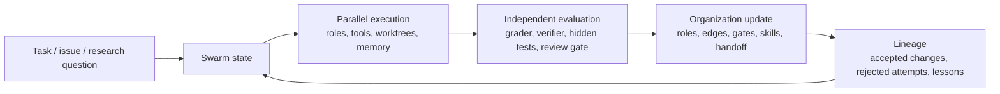

# Agent-Swarm Evolve Part

## One Sentence

Agent-Swarm Evolve is a part inside the multi-agent / harness discussion: it asks whether the agent team organization itself can update from feedback.

## Three Sentences

This is not a separate taxonomy category. It is a focused section for cases where roles, topology, shared state, verifier teams, handoff protocols, and lineage become mutable parts of a multi-agent system. The evidence path stays inside the existing repository flow: raw captures, project model cards, README explanation, wiki note, and website section.

## Five-Sentence Compression

1. Ordinary multi-agent systems coordinate multiple roles; this part asks whether the coordination pattern itself changes after evaluation.
2. The mutable object can be role mix, communication graph, shared memory, review gate, verifier policy, task routing, or handoff protocol.
3. The feedback can come from graders, hidden tests, independent reviewers, cost/success curves, contradiction ratios, or human review.
4. The retained result should be a traceable organization update, not just a final answer.
5. The main risks are consensus illusion, duplicated cost, shared-state pollution, weak verifier independence, and unclear responsibility.

## Minimal Loop

## Boundary Test

| Question | Good answer | Reject if |
|---|---|---|
| What changes? | Roles, topology, routing, shared memory, verifier policy, skill set, task decomposition, or review gates. | Only final content changes. |
| What selects the change? | Objective score, grader, verifier team, human review, cross-agent contradiction ratio, cost/success curve, or hidden test. | Agents merely vote or praise each other. |
| What is retained? | Updated topology, role prompt, reusable lesson, archive entry, task pattern, or validated skill. | The run ends with no reusable state. |
| What protects against swarm failure? | Independent evaluator, adversarial reviewer, isolated workspaces, dissent rule, rollback, cost cap, and trace log. | Same model repeats the same view under different role names. |

## Evidence Table

| System | Swarm-evolve signal | Evidence status |
|---|---|---|
| CORAL | Autonomous agent organizations run in isolated worktrees, share public state, and are scored by a grader daemon; heartbeat prompts guide reflection, consolidation, and pivots. | [KNOWN] Source: `raw-github/human-agent-society_coral.md`; processed card: `projects/89-coral-multi-agent-evolution.md` |
| EvoMAC | Evolves multi-agent collaboration networks by changing agents and edges under environment feedback, with rSDE-Bench as task feedback. | [KNOWN] Source: `projects/evomac-multi-agent-evolution.md`; related review: `paper-reviews/review-2410.16946-evomac.md` |
| GPTSwarm | Represents LLM agents as graphs and optimizes inter-agent edges for swarm efficiency and self-improvement. | [KNOWN] Source: `raw-github/metauto-ai_gptswarm.md` |
| metaswarm | Coordinates specialized agents through recursive orchestration, parallel review gates, cross-model review, and knowledge extraction. | [KNOWN] Source: `raw-github/dsifry_metaswarm.md` |
| swarmclaw | Self-hosted agent runtime for autonomous agent swarms with memory, schedules, delegation, MCP tools, and multiple providers. | [KNOWN] Source: `raw-github/swarmclawai_swarmclaw.md`; processed card: `projects/93-swarmclaw-agent-runtime.md` |
| OpenClaw Multi-Agent Team | Uses dynamic team assembly, parallel waves, independent verifier, quality gates, and self-evolution gears. | [KNOWN] Source: `raw-github/richchen-maker_openclaw-multi-agent-team.md` |
| Insight Swarm | Replaces central orchestration with a shared knowledge graph, tension detection, cross-agent evidence, and mandatory challenge votes. | [KNOWN] Source: `raw-github/uid4oe_insight-swarm.md` |

## Four Subparts

| Subpart | What changes | Good examples | Main verification need |
|---|---|---|---|
| Topology optimization | Nodes, edges, routing, communication probabilities | GPTSwarm, EvoMAC | Held-out tasks and edge-change ablations |
| Autonomous organization infrastructure | Workspaces, shared state, graders, heartbeat policies, archives | CORAL, metaswarm | Grader independence and lineage replay |
| Production swarm runtime | Schedules, delegation, memory, provider routing, tool permissions | swarmclaw, OpenClaw Multi-Agent Team | Real workflow success, cost, and permission audit |
| Graph-mediated emergence | Shared knowledge graph, contradiction links, synthesis constraints | Insight Swarm | Anti-groupthink metrics and source traceability |
